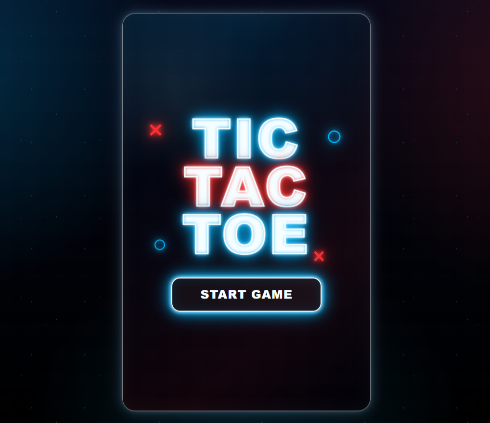
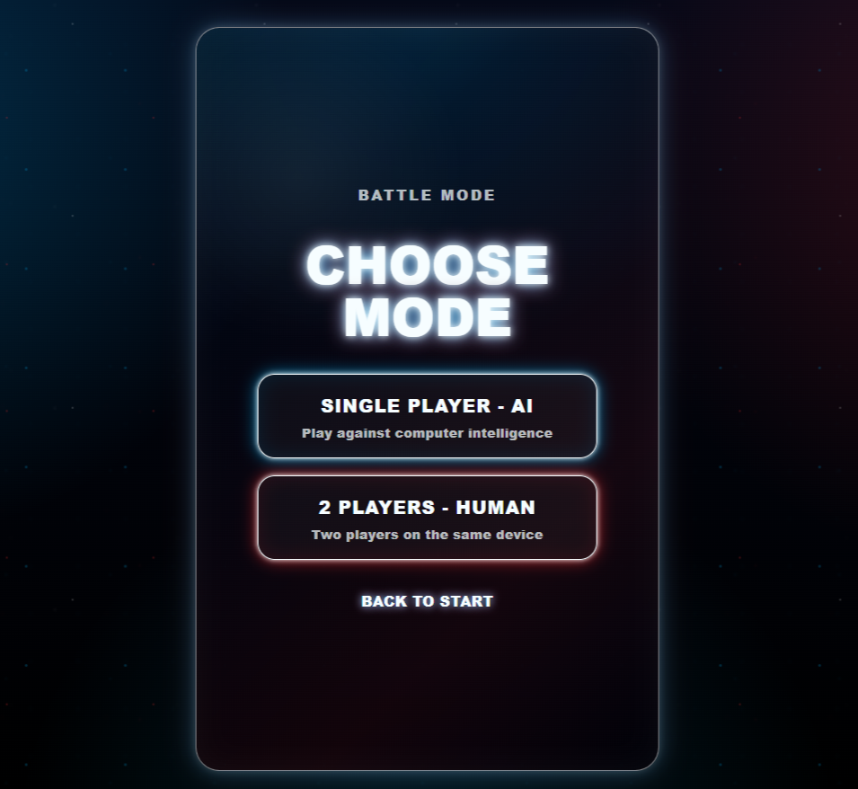
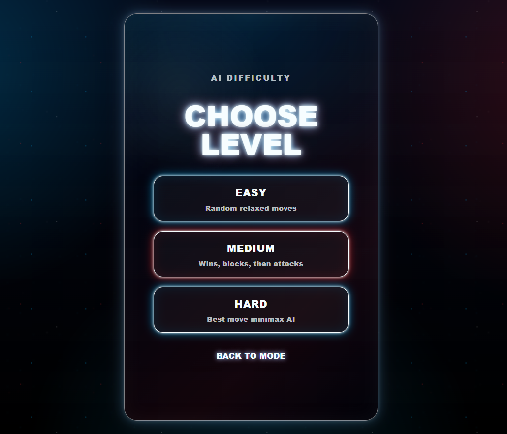
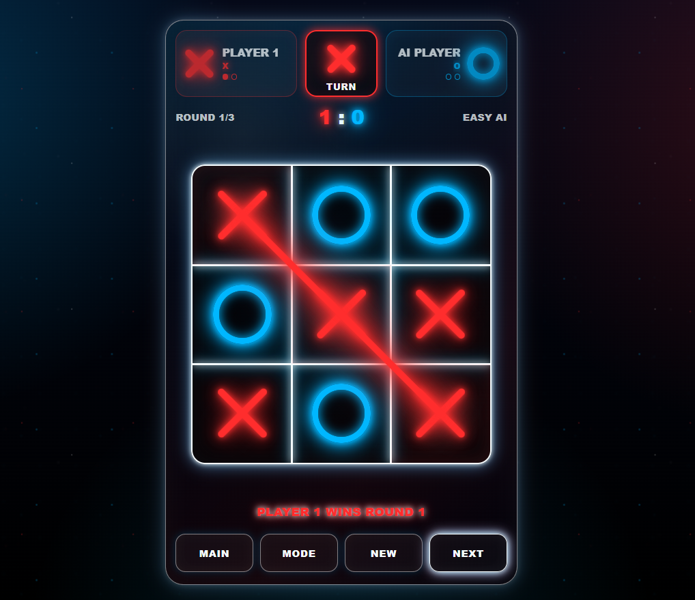

<div align="center">

# ❌⭕ TicTacToe — Game

A modern neon-style Tic-Tac-Toe game built with **Next.js**, **React**, **TypeScript**, and **Tailwind CSS**. The project includes single-player AI mode, two-player human mode, difficulty selection, best-of-3 match flow, clean neon UI, and responsive gameplay.


</div>

---

## 📌 Project Overview

**TicTacToe Neon** is a polished frontend game project designed with a clean neon interface and smooth match flow. The game supports both **Single Player - AI** and **2 Players - Human** modes. In AI mode, users can choose between **Easy**, **Medium**, and **Hard** difficulty levels before starting the match.

The project focuses on responsive UI design, reusable React state handling, solid winner detection, SVG-based winning lines, and a best-of-3 match system suitable for a frontend portfolio.

---

## ✨ Features

- 🎮 **Single Player - AI** mode
- 👥 **2 Players - Human** mode
- 🧠 **Difficulty selection**: Easy, Medium, and Hard
- 🏆 **Best-of-3 match system**
- ⚔️ **Deciding third round** when both players win one round each
- ❌ **Consistent red neon X** across board, turn box, player cards, and result screen
- ⭕ **Consistent blue neon O** across board, turn box, player cards, and result screen
- 📐 **Accurate SVG winning line** for rows, columns, and diagonals
- 🔁 **New match, Main menu, and Mode selection navigation**
- 📱 **Fully responsive 100vh layout**
- 🧼 **Clean neon UI** without excessive glow
- ⚡ **Fast Next.js App Router setup**
- 🛡️ **TypeScript-based safer component logic**

---

## 🖼️ Screenshots

> Add your screenshots inside `public/screenshots/` using the same file names shown below.

| Start Screen | Mode Selection |
|-------------|----------------|
|  |  |

| Game Board | Winner Screen |
|-----------|---------------|
|  |  |

---

## 🧰 Tech Stack

### Frontend

- Next.js 15
- React 19
- TypeScript
- Tailwind CSS 4
- Custom CSS neon effects
- SVG overlay for winning line rendering

### Game Logic

- React state management using hooks
- Turn-based X/O gameplay
- Win, loss, and draw detection
- Best-of-3 scoring system
- AI move generation
- Hard AI powered by minimax logic

---

## 📁 Folder Structure

```bash
TicTacToe-NextJS/
├── app/
│   ├── globals.css
│   ├── layout.tsx
│   └── page.tsx
├── components/
│   └── TicTacToe.tsx
├── public/
│   └── screenshots/
│       ├── 1.png
│       ├── 2.png
│       ├── 3.png
│       └── 4.png
├── .gitignore
├── eslint.config.mjs
├── LICENSE
├── next.config.ts
├── package.json
├── postcss.config.mjs
├── README.md
└── tsconfig.json
```

---

## 🚀 Getting Started

### 1. Clone the repository

```bash
git clone https://github.com/CodeByMan/TicTacToe-NextJS.git
cd TicTacToe-NextJS
```

### 2. Install dependencies

```bash
npm install
```

### 3. Start the development server

```bash
npm run dev
```

The app runs by default at:

```bash
http://localhost:3000
```

---

## 📜 Available Scripts

| Command | Description |
| --- | --- |
| `npm run dev` | Start the Next.js development server |
| `npm run build` | Create a production build |
| `npm start` | Start the production server |
| `npm run lint` | Run ESLint checks |

---

## 🎯 Game Flow

```bash
Start Game
└── Select Mode
    ├── Single Player - AI
    │   └── Select Level: Easy / Medium / Hard
    │       └── Match starts
    └── 2 Players - Human
        └── Match starts
```

---

## 🧠 AI Levels

| Level | Behavior |
| --- | --- |
| Easy | Chooses random valid moves |
| Medium | Tries to win, block, and make better attacking moves |
| Hard | Uses minimax-style decision making for stronger gameplay |

---

## 🧪 Production Build

Create a production build:

```bash
npm run build
```

Run the production server:

```bash
npm start
```

---

## 🌐 Deployment

This project can be deployed easily on platforms like **Vercel**.

Recommended deployment steps:

1. Push the project to GitHub.
2. Import the repository into Vercel.
3. Keep the default Next.js build settings.
4. Deploy.

---

## 🧑‍💻 Author

**Muhammad Ali Nawaz**  
Next.js / React Developer

---

## 📄 License

This project is open-sourced software licensed under the [MIT license](LICENSE).

---

<p align="center">
  <b>⭐ If you like this project, consider starring the repository!</b>
</p>
